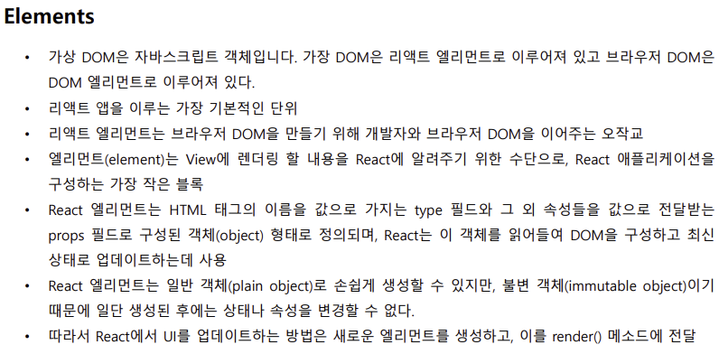
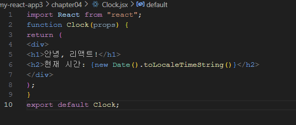
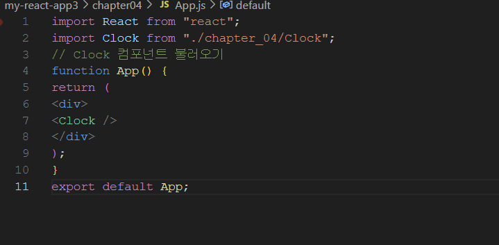
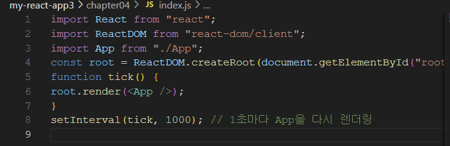

# 3주차 수업 내용
 

- 엘리먼트의 정의
    - 엘리먼트는 태그와 콘텐츠를 합친 것이다.
    - 리액트 앱을 구성하는 가장 작은 블록들이다.
    - 리액트의 엘리먼트는 우리 눈에 실제로 보이는 것을 기술함.
    - 리액트의 엘리먼트는 타입과 Props로 구성되어 있다. 

- 렌더링 정의
    - 렌더링(rendering)은 컴포넌트가 화면(UI)에 그려지는 과정이야. 쉽게 말해서, React 컴포넌트가 HTML을 생성해서 브라우저에 표시하는 과정이다.

# 3주차 실습 내용
### Clock.jsx

### App.js

### index.js

